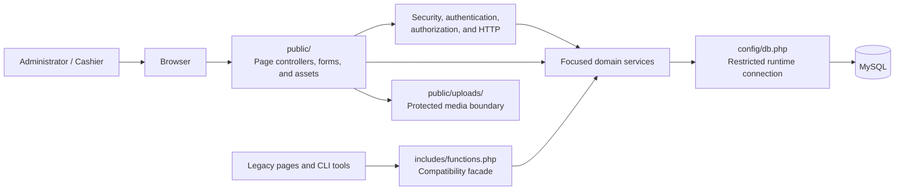
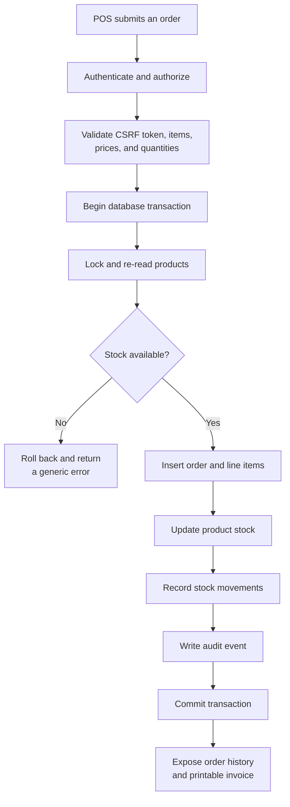
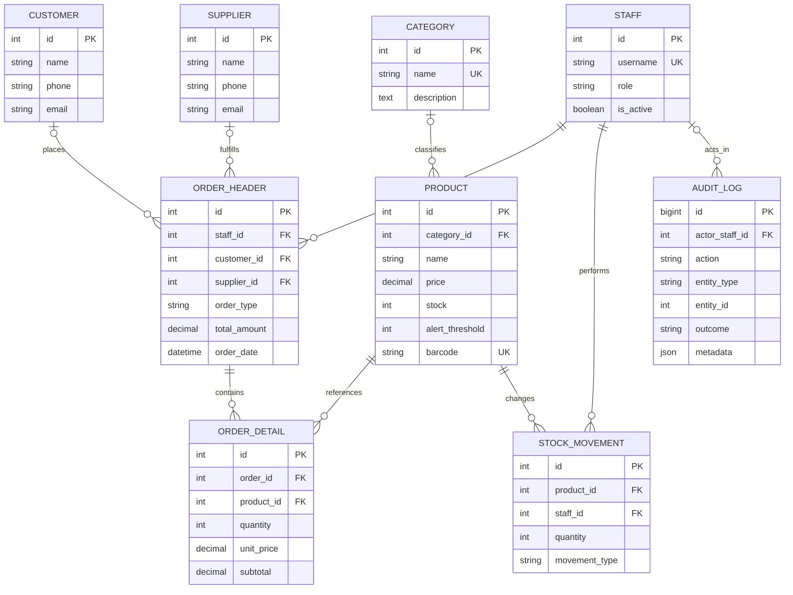
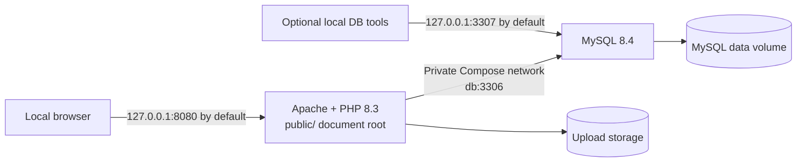

# MyShop

**A secure, localhost-first inventory, point-of-sale, and order management system for small retail operations.**

MyShop is a server-rendered PHP and MySQL application for running day-to-day shop operations from one responsive interface. It combines sales and purchase processing, stock control, customer and supplier records, reporting, audit history, and printable invoices without requiring a PHP framework or frontend build system.

> The reviewed baseline is published on [main](https://github.com/mohammad-emad-dev/myshop-PHP-System/tree/main) and mirrored on [security-hardening-baseline](https://github.com/mohammad-emad-dev/myshop-PHP-System/tree/security-hardening-baseline) for traceability. The application is intended for a protected local computer through Docker or XAMPP. It is not configured as a public internet service.

> No default administrator username or password is shipped with the repository. Create the first local administrator explicitly through the CLI bootstrap described below.

## What it does

- Runs sales and purchases from a split-screen POS terminal.
- Tracks products, categories, customers, suppliers, stock levels, and stock movements.
- Keeps product prices and available stock authoritative on the server.
- Provides dashboard KPIs, charts, low-stock alerts, order history, CSV exports, and invoices.
- Separates administrator and cashier capabilities at the server boundary.
- Uses transactions for order, product, category, customer, supplier, and stock mutations.
- Protects state-changing requests with CSRF checks, secure sessions, rate limiting, and audit logging.
- Uses bounded reads for interactive catalog, history, selector, dashboard, and report screens.

## Screenshots

These are sanitized screenshots from the current UI baseline. They contain no real credentials or customer data.

| Login | Dashboard |
| --- | --- |
|  |  |

| Product catalog | POS terminal |
| --- | --- |
|  |  |

The full responsive evidence set is kept in [docs/ui/baselines/](docs/ui/baselines/), including 375px, 768px, and 1440px captures.

## Architecture

MyShop keeps HTTP handling at the web boundary and business rules in focused service modules. `includes/functions.php` remains a compatibility facade for older callers while new work is assigned to the smallest domain module that owns the behavior.

### Component model

### Transactional order and stock lifecycle

The browser submits intent, not authoritative totals. The server validates the request, re-reads products inside a transaction, and commits the order, inventory change, stock ledger, and audit event as one unit.

### Core data model

The relational model keeps catalog, people, order, inventory, and audit concerns explicit. `ORDER_HEADER` represents the quoted MySQL `Order` table. `LoginRateLimit` is a standalone authentication-support table keyed by a normalized account hash and source IP address.

### Local deployment topology

Only `public/` should be exposed as the web document root. The repository root, `config/`, `database/`, backup files, and local environment files must remain outside it. See [the detailed architecture diagrams](docs/architecture/DIAGRAMS.md) for request ownership and authentication, authorization, and database trust boundaries.

## Repository layout

~~~text
public/                 HTTP entry points, assets, protected upload boundary
includes/               Focused services, compatibility facade, and shared layouts
config/                 Runtime database configuration
database/               Canonical schema, migrations, and bootstrap utility
docker/                 Apache and PHP container configuration
scripts/                Local QA, smoke, security, and release checks
tests/                  Dependency-free unit and MySQL integration tests
e2e/                    Playwright browser journeys
.github/workflows/      Quality Gate and release-integrity workflows
docs/architecture/      Ownership maps, contracts, and refactoring evidence
docs/ui/                Design decisions and responsive UI baselines
screenshots/            Curated README screenshots
~~~

## Run it locally with Docker

### Requirements

- Docker Desktop using the Linux container engine.
- Git.

XAMPP is supported as a manual alternative; see [the local deployment runbook](docs/PRODUCTION-DEPLOYMENT.md).

### 1. Clone the reviewed baseline

~~~powershell
git clone https://github.com/mohammad-emad-dev/myshop-PHP-System.git
cd myshop-PHP-System
~~~

### 2. Create local settings

~~~powershell
Copy-Item .env.example .env
notepad .env
~~~

Use separate, long local passwords for the database and bootstrap administrator. Never commit .env.

### 3. Start the stack

~~~powershell
docker compose --env-file .env config --quiet
docker compose --env-file .env up --build -d
docker compose --env-file .env ps
~~~

Open [http://127.0.0.1:8080](http://127.0.0.1:8080). The port can be changed with APP_PORT in .env; keep the host binding on 127.0.0.1.

### 4. Create the first administrator

There is no pre-seeded administrator account. Set the following local values in `.env`; these are examples, not credentials:

~~~text
BOOTSTRAP_ADMIN_USERNAME=local_admin
BOOTSTRAP_ADMIN_FULL_NAME=Local Administrator
BOOTSTRAP_ADMIN_PASSWORD=replace_with_a_long_unique_password
~~~

Then run the CLI-only bootstrap profile:

~~~powershell
docker compose --env-file .env --profile bootstrap run --rm bootstrap
~~~

The bootstrap password must be at least 12 characters. The bootstrap command is not an HTTP route.

### Stop or restart

~~~powershell
docker compose --env-file .env down
docker compose --env-file .env up -d
docker compose --env-file .env restart
docker compose --env-file .env ps
~~~

Do not use down --volumes unless the local database is disposable.

## Verification

The repository uses a dependency-free PHP test harness plus a separate Playwright layer. The integration suite creates disposable databases and removes them during cleanup; it does not use the normal ioms_db database.

~~~powershell
# Syntax and configuration
docker compose --env-file .env config --quiet
php scripts/repository-security-check.php
php scripts/ci-supply-chain-check.php

# Full unit and integration suite (run from the app container)
docker compose --env-file .env exec -T app php tests/run.php

# Responsive browser journeys on a disposable stack
pwsh -File scripts/run-browser-qa.ps1
~~~

See [docs/BROWSER-QA.md](docs/BROWSER-QA.md) for browser prerequisites and [docs/PRODUCTION-DEPLOYMENT.md](docs/PRODUCTION-DEPLOYMENT.md) for local health, backup, restore, and recovery procedures.

## Security boundaries

- State-changing requests require POST and CSRF validation.
- Authorization is enforced on the server; hiding a button is not the security boundary.
- Cashiers can sell and view their own order history but cannot use administrator-only purchase, staff, settings, audit, or backup workflows.
- Order and stock writes use transactions and record stock movements and audit events.
- Login failures are rate-limited per normalized account and source IP.
- The runtime database account has CRUD privileges only; schema changes use a separate controlled account.
- Uploads are validated and served from a protected directory.
- Database failures are logged without exposing SQL details or stack traces to users.
- Health and readiness endpoints return generic responses and do not disclose internal diagnostics.

This project intentionally does not claim to provide cloud controls such as TLS termination, WAF, secret-manager integration, an internet-facing firewall, external monitoring, or off-site backup infrastructure. Those controls belong to a separate deployment environment.

No latency, throughput, or barcode-scan benchmark is published in this README. Performance figures should be added only with a reproducible benchmark and a stated environment.

## Local operations and release notes

MyShop is a localhost-first application. It is not intended to be exposed directly to the public internet. Keep Docker web and database ports on 127.0.0.1; APP_PORT and MYSQL_PORT can be changed when local port conflicts occur.

The normal local workflow includes restart and recovery checks after Docker, Apache, MySQL, or the host machine restarts. Keep local backup files outside the repository and document root. A verified backup must contain the MYSHOP_BACKUP_COMPLETE marker before it is accepted for restore.

The optional production verification path is separate from the localhost install. Its preflight validates required production settings, rejects placeholder credentials and mutable image tags, and checks that schema credentials are not passed to the normal application service. When building a release candidate, use a temporary CI build tag, resolve the built image ID to its immutable digest, and deploy only after the digest passes preflight.

## Engineering notes

includes/functions.php is a compatibility facade for older pages and CLI tools. New work belongs in the smallest focused module that owns its dependencies. Focused modules must not load the facade back, and new functions should not be duplicated across modules.

The architecture and UI history is intentionally kept in docs/ so a reviewer can follow the refactoring decisions without mixing historical evidence into runtime code. Start with:

- [docs/architecture/BASELINE.md](docs/architecture/BASELINE.md) — current ownership baseline.
- [docs/architecture/DEPENDENCY-MAP.md](docs/architecture/DEPENDENCY-MAP.md) — module and caller relationships.
- [docs/architecture/REFACTORING-CONTRACT.md](docs/architecture/REFACTORING-CONTRACT.md) — behavior-preservation rules.
- [docs/ui/PHASE-6G-FINAL-UI-CLOSURE-TDD.md](docs/ui/PHASE-6G-FINAL-UI-CLOSURE-TDD.md) — final UI evidence and known limits.

## Git workflow

The project follows GitHub Flow: make a focused branch, run the relevant checks, commit with a descriptive Conventional Commit message, and open a pull request when the change is ready for review. `main` is the published baseline; `security-hardening-baseline` is kept as a mirrored traceability branch.

## License

No open-source license has been published yet. Add a license before distributing MyShop as a reusable package.
