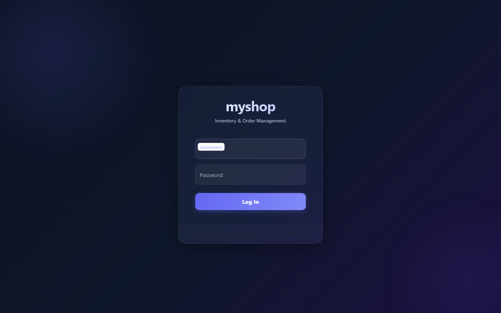
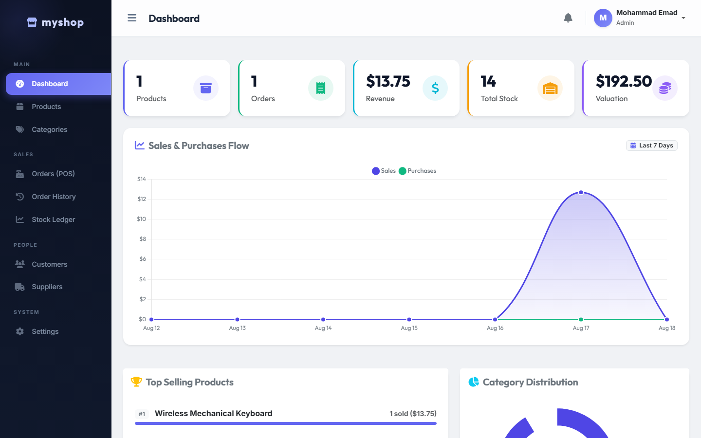
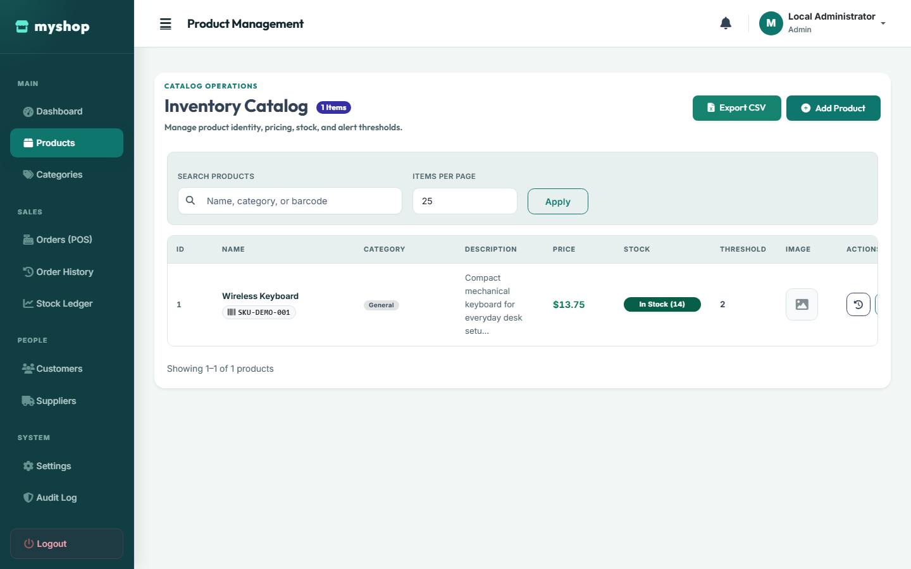
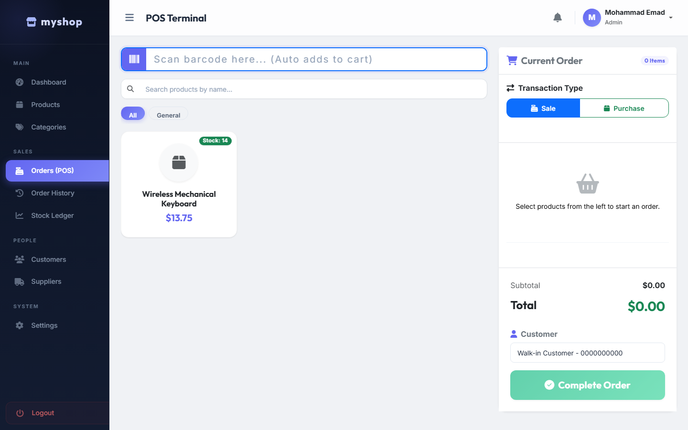

# MyShop

MyShop is a native PHP and MySQL inventory, point-of-sale, and order management system.

It is built as a portfolio-grade software engineering project with a focus on secure database access, role-based authorization, transactional stock updates, and practical deployment hygiene.

> **Current status:** Security-hardened Release Candidate. This release candidate is published on the [security-hardening-baseline](https://github.com/mohammad-emad-dev/myshop-PHP-System/tree/security-hardening-baseline); `main` remains the previous published baseline until this branch is reviewed and merged. It is suitable for portfolio review and local evaluation; production deployment still requires the deployment checklist below.

## Highlights

- Admin and cashier roles with server-side authorization.
- Product, category, customer, supplier, staff, and stock management.
- Sales and purchase orders with server-side pricing and stock validation.
- Transactional order creation and stock-movement history.
- Server-side product pagination for catalog views.
- Dashboard metrics, reports, CSV export, invoices, and protected database backups.
- Password hashing, password policy enforcement, CSRF protection, secure sessions, and generic database errors.
- Account/IP-aware login rate limiting with fail-closed behavior when its database control is unavailable.
- Queryable audit logging for authentication, authorization denials, staff, inventory, orders, settings, and backup operations.
- Restricted runtime database privileges: SELECT, INSERT, UPDATE, and DELETE only.
- Hardened uploads, CSV formula protection, security headers, and a nonce-based Content Security Policy.
- Docker-based local runtime with a dedicated schema/migration workflow.

## Screenshots

| Login | Dashboard |
|---|---|
|  |  |

| Products | Orders |
|---|---|
|  |  |

## Architecture

MyShop is a server-rendered, page-oriented PHP application. It does not require a PHP framework or a JavaScript build step.

~~~text
public/                 Apache document root and web routes
includes/               Shared authentication, database, validation, and layouts
config/                 Runtime database configuration
database/               Canonical schema, migrations, and CLI bootstrap utility
public/assets/          CSS, JavaScript, and static assets
public/uploads/         Validated user-uploaded images
docker/                 Apache container configuration
docs/                   Supporting project documentation
screenshots/            Curated documentation images
~~~

Only public/ should be exposed as the web document root. The repository root, config/, database/, backups, and local environment files must not be publicly served.

### Shared service ownership

`includes/functions.php` remains the compatibility facade. Existing pages and CLI utilities should continue requiring it; it loads the focused shared modules exactly once and preserves the legacy global function names and return contracts.

- `includes/security.php` owns sessions, CSRF, security headers/CSP, trusted-proxy HTTPS detection, request correlation, source-IP helpers, and asset integrity metadata.
- `includes/audit.php` owns bounded audit metadata handling, audit writes, filters, and paginated audit-log reads.
- `includes/pagination.php` owns page/page-size normalization and bounded list-search normalization.
- `includes/backup.php` remains separate because backup streaming has its own operational and authorization boundary.
- `includes/catalog.php` owns bounded product and category reads; `includes/people.php` owns bounded customer and supplier reads; and `includes/inventory.php` owns bounded stock-movement count/page reads plus the compatibility-preserving movement writer.
- Database/business workflows, including authentication rate limiting, inventory mutations, orders, staff, and reference-data CRUD, remain in the facade or page controllers until a future refactor establishes and tests their dependency boundaries.

Future features should place new code in the smallest cohesive module that owns its dependencies, then expose it through the facade only when existing callers require the compatibility surface. Modules must not require the facade back, and functions must not be duplicated across modules.

## Run locally with Docker

### Requirements

- Docker Desktop with the Linux container engine.
- Git.

### 1. Clone the published baseline

~~~powershell
git clone -b security-hardening-baseline https://github.com/mohammad-emad-dev/myshop-PHP-System.git
cd myshop-PHP-System
~~~

### 2. Create local environment values

~~~powershell
Copy-Item .env.example .env
notepad .env
~~~

Replace every password placeholder with a separate, long, locally scoped value. Never commit .env.

### 3. Validate and start the stack

~~~powershell
docker compose --env-file .env config --quiet
docker compose --env-file .env up --build -d
docker compose --env-file .env ps
~~~

The application is available at http://127.0.0.1:8080 by default. The port can be changed through APP_PORT in .env.

The first initialization of a new MySQL volume imports database/schema.sql and applies the runtime privilege restriction. Initialization scripts do not run again for an already initialized volume.

### 4. Create the first administrator

Set these values in .env:

~~~text
BOOTSTRAP_ADMIN_USERNAME=local_admin
BOOTSTRAP_ADMIN_FULL_NAME=Local Administrator
BOOTSTRAP_ADMIN_PASSWORD=replace_with_a_long_unique_password
~~~

Then run the CLI-only bootstrap profile:

~~~powershell
docker compose --env-file .env --profile bootstrap run --rm bootstrap
~~~

The bootstrap password must be at least 12 characters. The bootstrap utility is not an HTTP route and is not included in the normal web service environment.

### 5. Stop the stack

~~~powershell
docker compose --env-file .env down
~~~

Do not use down --volumes unless the local database is disposable.

## Production Compose baseline

`docker-compose.production.yml` is a deployment baseline, not an external deployment. It is selected explicitly and is never auto-merged with the development file:

~~~powershell
Copy-Item .env.example .env.production
# Edit .env.production using the production secret manager and reviewed image references.
docker compose --env-file .env.production -f docker-compose.production.yml config --quiet
docker compose --env-file .env.production -f docker-compose.production.yml build --pull app
docker compose --env-file .env.production -f docker-compose.production.yml up -d
docker compose --env-file .env.production -f docker-compose.production.yml ps
~~~

The production application image copies the reviewed source at build time and has no repository bind mount. Only a named `production_uploads` volume is writable by the application. The application root is read-only, Apache runtime/log paths use tmpfs, and both services restart unless stopped. MySQL has no published host port; a reverse proxy must be attached to the deployment network or use the platform’s internal service routing. The production Compose file does not run a browser-accessible schema or restore operation.

Fresh-volume database initialization uses the canonical schema and the restricted runtime-account initializer. Existing databases still require the controlled schema-account migration process documented above; do not treat container startup as a migration mechanism. The CLI-only bootstrap can be run as a controlled one-shot using deployment-injected `BOOTSTRAP_ADMIN_*` variables; never put those values in the image, repository, command history, or logs.

The fail-closed production preflight validates required production settings, rejects placeholder credentials and mutable image tags, checks HSTS and trusted-proxy configuration, and confirms that root/schema credentials are not passed to the normal app service:

~~~powershell
php scripts/production-preflight.php --env-file .env.production --compose-file docker-compose.production.yml
~~~

See [docs/PRODUCTION-DEPLOYMENT.md](docs/PRODUCTION-DEPLOYMENT.md) for the complete deployment, backup, migration, readiness, rollback, HSTS, logging, and external-operations runbook. This repository remains a production-deployable baseline rather than a standalone production operation.

### Disposable production runtime smoke

Run the production Compose baseline against a fresh, uniquely named disposable
project without reading `.env` or using `ioms_db`:

~~~powershell
powershell -NoProfile -ExecutionPolicy Bypass -File scripts/run-production-smoke.ps1
~~~

The runner builds the production stage from the current checkout, injects only
generated temporary credentials, exposes the app on a loopback-only port, and
does not publish MySQL. It verifies generic liveness/readiness responses,
readiness `503` while MySQL is stopped and recovery to `200`, read-only root
filesystem and writable-volume boundaries, `no-new-privileges`, forbidden
credential absence from the app environment, Git absence, and disabled PHP
error display. It removes the project, volumes, network, image, and temporary
files in cleanup; cleanup failure fails the run.

The Quality Gate runs this smoke as a separate 15-minute read-only job. This is
not a deployment and does not verify external TLS, firewalling, registry
promotion/signing, secret-manager delivery, monitoring, backup storage, or
rollback infrastructure.

### Production environment and TLS contract

The production environment must provide, through a secret manager or protected deployment configuration:

- `DB_NAME`, restricted CRUD-only `DB_USER`, and `DB_PASSWORD`.
- `MYSQL_ROOT_PASSWORD` only to the database initialization/deployment boundary; never to the normal application service.
- `PHP_BASE_IMAGE`, reviewed at the exact PHP 8.3 Apache release/digest used for the build.
- `PRODUCTION_APP_IMAGE`, an immutable registry digest for the reviewed application image.
- `PRODUCTION_MYSQL_IMAGE`, pinned to the reviewed MySQL version/digest. The example currently records the reviewed MySQL 8.4.3 digest; refresh it deliberately during patching.
- `TRUSTED_PROXY_IPS`, a comma-separated exact-IP allow-list for the fixed reverse proxy; production preflight requires it when HSTS is enabled.
- `HSTS_ENABLED=false` during local HTTP development. Production preflight requires `true` after HTTPS is guaranteed for the complete hostname and subdomain policy; set `HSTS_MAX_AGE` deliberately.

The PHP session marks cookies `Secure` when the request is HTTPS. `X-Forwarded-Proto: https` is honored only when `REMOTE_ADDR` is in `TRUSTED_PROXY_IPS`; arbitrary client-supplied forwarding headers are ignored. TLS certificates, HTTPS redirects, proxy source-IP preservation, trusted-proxy network policy, HSTS preload/subdomain decisions, and external firewalling remain deployment responsibilities. The repository does not force HTTPS in local development.

The PHP production configuration disables display errors and startup error display, sends technical errors to container stderr, hides exception arguments, and keeps strict HTTP-only session settings. User-facing health and database failures remain generic.

### Health, logs, and alerts

- `/health.php` is liveness-only and returns HTTP 200 without opening MySQL.
- `/ready.php` is database readiness. It returns HTTP 200 only when `SELECT 1` succeeds and HTTP 503 with a generic body when the database is unavailable. It never returns SQL errors, credentials, paths, or stack traces.
- The production application healthcheck uses `/ready.php`; the MySQL healthcheck uses `mysqladmin ping` locally inside the database container.
- Apache access logs go to stdout and errors go to stderr. PHP technical errors go to stderr through `/proc/self/fd/2`. Docker or the deployment runtime must collect, restrict, rotate, and retain these streams according to operational policy.
- Each HTTP request receives a server-generated `X-Request-ID`; request start/completion logs and Apache access logs include it. Client-provided correlation IDs, cookies, authorization headers, CSRF tokens, passwords, request bodies, and database credentials are not logged.

At minimum, alert on readiness failures, sustained HTTP 5xx rates, elevated latency, authentication failure/rate-limit spikes, authorization-denied spikes, database connection/replication/storage failures, backup generation or restore-verification failures, upload storage exhaustion, and host/container disk pressure. Define log retention, access control, redaction review, rotation, and on-call escalation before production use.

### Image patching process

Review PHP/Apache, MySQL, Debian, and extension security advisories; select a compatible exact version; resolve and record immutable image digests; rebuild the production stage; run Compose validation, syntax checks, regression/restore tests, and a staging smoke test; then roll out with a rollback image reference retained. The example pins the reviewed PHP base and MySQL image digests for the current build architecture; release automation must re-resolve and review architecture-appropriate digests when the platform or versions change. No external registry, monitoring vendor, or production deployment was configured by this batch.

### CI and release integrity

Every third-party GitHub Action in `.github/workflows/` is pinned to a full 40-character commit SHA with an inline official release comment. The current verified pins are `actions/checkout` `11d5960a326750d5838078e36cf38b85af677262` (v4.4.0), `actions/setup-node` `49933ea5288caeca8642d1e84afbd3f7d6820020` (v4.4.0), and `shivammathur/setup-php` `f3e473d116dcccaddc5834248c87452386958240` (2.37.2). The Quality Gate runs a dependency-free policy check over tracked workflow files and the production Compose file; it rejects mutable action refs and deployable image tags without printing credentials.

The production job may use a temporary `myshop-app:ci-$GITHUB_SHA` tag solely while building a disposable CI image. That tag is never deployable: the job resolves the built image ID to a digest, runs the fail-closed production preflight, and emits safe release evidence with `php scripts/release-integrity-check.php`. Production configuration must use `name@sha256:<64 hex chars>` for the PHP base, application, and MySQL images.

Run the policy and release checks locally without committing a manifest:

~~~powershell
# Run the policy from a Git-enabled PHP CLI checkout. The normal app image
# intentionally does not contain Git.
php scripts/ci-supply-chain-check.php
$env:RELEASE_COMMIT_SHA = (git rev-parse HEAD)
$env:RELEASE_WORKFLOW = 'local-verification'
$env:RELEASE_REF = 'local'
$env:RELEASE_IMAGE_REFERENCE = 'registry.example/myshop@sha256:aaaaaaaaaaaaaaaaaaaaaaaaaaaaaaaaaaaaaaaaaaaaaaaaaaaaaaaaaaaaaaaa'
$env:RELEASE_VERIFICATION_STATUS = 'verified'
php scripts/release-integrity-check.php
Remove-Item Env:RELEASE_COMMIT_SHA, Env:RELEASE_WORKFLOW, Env:RELEASE_REF, Env:RELEASE_IMAGE_REFERENCE, Env:RELEASE_VERIFICATION_STATUS
~~~

To deliberately update an action, inspect the official repository tag with `git ls-remote`, review the release and commit, replace the ref with the exact 40-character SHA and release comment, then run the policy check and complete Quality Gate. For a base-image update, resolve the official image digest for the target architecture, update the reviewed value, rebuild and scan the image, and record the digest and verification result in the deployment change record. Never substitute `@latest`, a major tag, or an unreviewed registry reference.

## Verification

Validate the Compose model and lint the PHP sources with the same runtime used by Docker:

~~~powershell
docker compose --env-file .env config --quiet
docker compose --env-file .env run --rm --no-deps app sh -c 'find config database includes public -type f -name "*.php" -print0 | xargs -0 -n1 php -l'
~~~

The reviewed baseline has also been checked with disposable database integration tests, authorization/CSRF HTTP checks, Docker health checks, JavaScript syntax checks, and database-failure return-contract tests.

Every push to `main` or `security-hardening-baseline`, and every pull request, runs the repository Quality Gate in GitHub Actions. It validates tracked PHP and JavaScript syntax, development and production Docker Compose configuration, the production image build and preflight, the disposable production runtime smoke/isolation boundary, safe release metadata, the canonical schema/migration chain, dependency-free tracked-file secret/configuration and CI supply-chain policy scans, and the full disposable MySQL regression suite. The CI MySQL container uses the reviewed immutable `mysql:8.4.3@sha256:106d5197fd8e4892980469ad42eb20f7a336bd81509aae4ee175d852f5cc4565` reference.

The repository security check intentionally scans only Git-tracked files. It ignores the safe `.env.example`, documentation examples, and test fixtures, never prints matched values, and reports only high-confidence secrets, committed private keys, or unsafe production/workflow configuration:

~~~powershell
php scripts/repository-security-check.php
~~~

To exercise the production Compose checks locally with disposable values, copy the example environment to a file under the system temporary directory, replace only the application image with a local CI tag, then remove the file after validation:

~~~powershell
$productionEnv = Join-Path $env:TEMP 'myshop-production-ci.env'
Copy-Item .env.example $productionEnv
(Get-Content $productionEnv) -replace '^PRODUCTION_APP_IMAGE=.*$', 'PRODUCTION_APP_IMAGE=myshop-app:ci-local' | Set-Content $productionEnv
docker compose --env-file $productionEnv --file docker-compose.production.yml config --quiet
docker compose --env-file $productionEnv --file docker-compose.production.yml build --pull app
Remove-Item -LiteralPath $productionEnv -Force
~~~

The temporary values are placeholders only; with `TEST_DB_*` variables pointed at a separate disposable MySQL container, run `php tests/validate_schema.php` for the schema/migration check or `php tests/run.php` for the full suite, as described below. Neither command targets the normal `ioms_db` database.

### Automated regression tests

The repository uses a dependency-free CLI PHP harness instead of PHPUnit. This keeps the project free of a Composer dependency while still executing the real application functions and real MySQL transactions.

Run the unit and integration suite from Docker after the local stack is running. The command reads the root password into a process environment variable without printing it:

~~~powershell
$rootPasswordLine = Get-Content .env | Where-Object { $_ -match '^MYSQL_ROOT_PASSWORD=' } | Select-Object -First 1
$env:TEST_DB_ROOT_PASSWORD = $rootPasswordLine -replace '^MYSQL_ROOT_PASSWORD=', ''
docker compose --env-file .env exec -T `
  -e TEST_DB_HOST=db -e TEST_DB_PORT=3306 -e TEST_DB_ROOT_USER=root `
  -e TEST_DB_ROOT_PASSWORD="$env:TEST_DB_ROOT_PASSWORD" app php tests/run.php
Remove-Item Env:TEST_DB_ROOT_PASSWORD
~~~

The integration harness generates a unique `myshop_test_*` database and a random temporary runtime account. A controlled schema/root account loads `database/schema.sql` followed by the documented migrations; application operations then run through the restricted temporary runtime account. The harness never selects `ioms_db`, never uses the normal runtime account, and drops the temporary database and account in a `finally` cleanup step. Cleanup failure fails the test job and identifies the leftover artifact.

The test layers are deliberately separate:

- `tests/Unit/` covers sanitization, identifiers, password policy, CSRF helpers, and validation that completes before database access.
- `tests/Integration/` covers real MySQL schema, migrations, CRUD, transactions, stock/order integrity, authorization-sensitive order creation, rate limiting, and database-failure contracts.
- Browser E2E and accessibility QA remains a separate layer from the PHP suite. Run `pwsh -File scripts/run-browser-qa.ps1` from a Windows developer shell to build a disposable Compose database, create temporary admin/cashier fixtures, run the pinned Playwright/Chromium suite at 375px, 768px, and 1440px, and remove the project and its volume in cleanup. The runner never reads `.env`, never targets `ioms_db`, keeps the source mount read-only, and stores sanitized screenshots/results only under a temporary directory. See [docs/BROWSER-QA.md](docs/BROWSER-QA.md) for prerequisites and troubleshooting.

The GitHub Actions regression job creates its own disposable MySQL container with a generated root password, runs `php tests/run.php`, and removes the container and its volume even when the tests fail.

## Security model

- State-changing requests require POST and CSRF validation.
- Cashiers are restricted to sales and their own order visibility; administrative mutations are server-side protected.
- Product prices and stock are read and validated on the server.
- Order and stock writes use transactions and rollback on failure.
- Login failures are rate-limited per normalized account/IP pair.
- Login rate-limit failures fail closed with a generic response.
- The application database account cannot create, alter, drop, or grant database objects.
- Backup downloads require an active administrator, POST, CSRF validation, and current-password re-authentication.
- Uploaded files are validated and served from a protected upload directory.
- Database errors are logged server-side; SQL details and stack traces are not shown to users.
- Security headers and a nonce-based CSP protect the browser boundary.
- Audit-log reads are administrator-only and paginated; audit metadata is bounded and excludes passwords, CSRF tokens, session IDs, credentials, request bodies, and dump contents.
- Liveness/readiness endpoints are generic and do not expose internal diagnostics.
- Request correlation IDs are server-generated and safe for logs; sensitive request data is excluded.

## Database migrations

The normal PHP application never creates or migrates schema objects. Use a controlled deployment/schema account for existing databases.

For a database created from the original Batch 1 schema, run these migrations in order:

1. database/batch2_staff_active.sql
2. database/batch3_product_history.sql
3. database/batch14_runtime_privileges.sql
4. database/batch17_login_rate_limit.sql
5. database/batch22_audit_log.sql

Take and verify a backup before upgrading an existing database. Stop on the first migration error and inspect the database before retrying. Do not blindly import database/schema.sql into an existing database.

Batch 22 records security-sensitive and business-critical events in `AuditLog`. The migration is idempotent when the table is absent or already matches the canonical schema, but it deliberately fails on a partial or incompatible table so unrelated schema problems are not hidden. Execute migrations with a controlled deployment/schema account only; never run them from a web request or application startup. Databases created by pre-Batch-1 versions may require manual inspection before applying this order.

Fresh databases receive `AuditLog` from `database/schema.sql`; the migration is still required for existing databases and is safe to re-run against the canonical table.

Transactional product, stock, and order writes insert their success audit event before commit and roll back when that audit insert fails. Authentication, non-transactional CRUD/settings, authorization-denial, and backup-attempt entries use bounded best-effort logging: an audit insert failure is logged server-side and does not falsely report an audit event as successful or expose a database error to the user. Audit retention and deletion are deployment responsibilities and must follow the organization’s legal and operational requirements.

Administrators can review the bounded log at `public/audit_log.php`. Cashiers have no route access to this page. The application has no web restore endpoint; database restores are deployment/schema-account operations and must be recorded in the deployment change/operations log. The controlled CLI/test restore verification workflow is documented below.

## Backups and recovery

The application backup endpoint is a download-only operation. It has no web restore endpoint and does not write a backup file to the server. An active administrator must submit a `POST` request from the existing Settings UI with a valid CSRF token and current-password re-authentication. The response uses a fixed filename, no-cache headers, and streams the SQL dump through `php://output`.

The backup allow-list is explicit and ordered for foreign-key-safe restore:

`Staff`, `Category`, `Customer`, `Supplier`, `Product`, `Order`, `OrderDetail`, `StockMovement`, and `AuditLog`.

`LoginRateLimit` is intentionally excluded. It contains ephemeral account/IP failure state, not business history; restoring it could reintroduce expired blocks. A fresh target must receive `LoginRateLimit` from the canonical schema and `database/batch17_login_rate_limit.sql`, rather than from a business backup. Staff password fields contain one-way hashes because they are required for restore integrity; plaintext passwords are never stored or emitted. Treat every backup as highly sensitive credential-bearing data.

The stream ends with `-- MYSHOP_BACKUP_COMPLETE`, written only after the consistent read-only snapshot commits. Operators and restore tooling must reject a file without this marker. A failure after streaming begins may leave an incomplete download; the endpoint records the failure server-side, appends a non-technical failure marker when possible, and the incomplete file must be deleted rather than restored.

#### Local isolated restore verification

Run the existing CLI regression harness after the stack is running. It creates a unique `myshop_test_*` source database, applies `database/schema.sql` and all migrations in the documented order, generates a backup outside the repository, initializes a separate unique `myshop_restore_qa_*` database with the canonical schema and all migrations, loads the backup with a controlled root/schema connection, verifies tables, columns, indexes, foreign keys, row counts, and representative relationships, confirms that the excluded `LoginRateLimit` table is fresh, tests a restricted CRUD-only runtime account, and removes both databases, the temporary account, and files in a `finally` cleanup path:

~~~powershell
# Supply TEST_DB_ROOT_PASSWORD from a private deployment environment; never paste it into source or logs.
docker compose --env-file .env exec -T `
  -e TEST_DB_HOST=db -e TEST_DB_PORT=3306 -e TEST_DB_ROOT_USER=root `
  -e TEST_DB_ROOT_PASSWORD="$env:TEST_DB_ROOT_PASSWORD" app php tests/run.php
~~~

The verifier refuses `ioms_db` and the configured `DB_NAME` as source or restore targets. It uses the root/schema account only for disposable schema setup, restore, metadata checks, grants, and cleanup. The restored application connection is tested with a temporary restricted account; it is not granted DDL or `GRANT OPTION`. The normal local database and Docker volume are not selected by this workflow.

#### Production backup procedure and responsibilities

1. Configure the application `DB_HOST`, `DB_PORT`, `DB_NAME`, `DB_USER`, and `DB_PASSWORD` values from the production secret manager. Keep the runtime account CRUD-only. Keep schema/root credentials in a separate deployment secret, never in the web service environment or repository.
2. An active administrator downloads a backup through Settings after current-password re-authentication. Save it only to a protected path outside `public/`, the repository, and Docker bind mounts that serve the application.
3. Verify the completion marker and run the isolated restore verification before accepting the artifact into retention storage.
4. Encrypt the verified artifact at rest using the deployment-approved KMS/key-management process before it leaves the operator workstation or enters backup storage. Encryption is an operational requirement; this PHP endpoint intentionally streams plaintext SQL to the authenticated administrator and does not hold an encryption key.
5. Keep encryption keys outside `.env`, Git, backups, and the web container. For key rotation, re-encrypt retained artifacts with the new key and retain the old key only until all artifacts encrypted with it expire. If the encryption key or KMS is unavailable, fail the storage job and do not retain an unencrypted backup.
6. Keep at least one independent/off-site copy in storage controlled separately from the application host. Off-site replication is not configured by this repository and must not be assumed.

Deployment-owned variables should be defined in the secret manager or backup scheduler, not committed here:

- `BACKUP_STORAGE_PATH` — protected path outside the document root.
- `BACKUP_ENCRYPTION_KEY_ID` — KMS/key identifier; no key material belongs in the repository.
- `BACKUP_RETENTION_DAYS` — operator-approved retention value.
- `BACKUP_RPO` and `BACKUP_RTO` — documented service objectives.

Suggested starting values such as daily backups retained for 35 days, weekly copies for 12 weeks, and monthly copies for 12 months are policy placeholders only. Operators must choose values based on legal, business, storage, and recovery requirements. Define the actual RPO (`[deployment decision]`) and RTO (`[deployment decision]`) before production use, and schedule restore drills against the real deployment environment.

For a manual restore, stop application writes, create a uniquely named target database, apply `database/schema.sql` and the documented migrations first, and use a controlled schema/deployment account—not `DB_USER`—to load only a verified file whose completion marker is present. This preserves a fresh `LoginRateLimit` table while the backup replaces the allow-listed business and audit tables. Validate the schema, constraints, indexes, row counts, and application read access before any controlled cutover. There is deliberately no browser-accessible restore route.

Never place backups inside the document root, repository, or a public download directory.

## Production readiness roadmap

The current baseline is not independently production-ready. Remaining deployment and operational requirements include:

- HTTPS, secure secret provisioning, production HSTS, firewalling, and monitoring.
- Continuing bounded-query review for any remaining large POS, report, history, or selector dataset that is not covered by the existing pagination/export checks.
- Resolving and externally verifying the deployment-specific PHP base, application, and MySQL image digests, then patching Debian/Apache/PHP/MySQL through the documented release process.
- Keeping the implemented CI Quality Gate, disposable production smoke, Browser QA, and accessibility checks green for each release candidate.
- Splitting the large shared functions module into focused application services over time.

These items are tracked as follow-up engineering work rather than hidden behind a production-ready claim.

## Git workflow

The project follows a lightweight GitHub Flow:

1. Create a short-lived feature or fix branch from the current baseline.
2. Make one focused change.
3. Run the relevant verification checks.
4. Commit with a descriptive Conventional Commit message.
5. Open a Pull Request and document the evidence.

Security baseline preceding the regression-suite work: 06a4e9f (fix: address final regression findings).

## License

Add the project license before treating this repository as a reusable open-source package.
