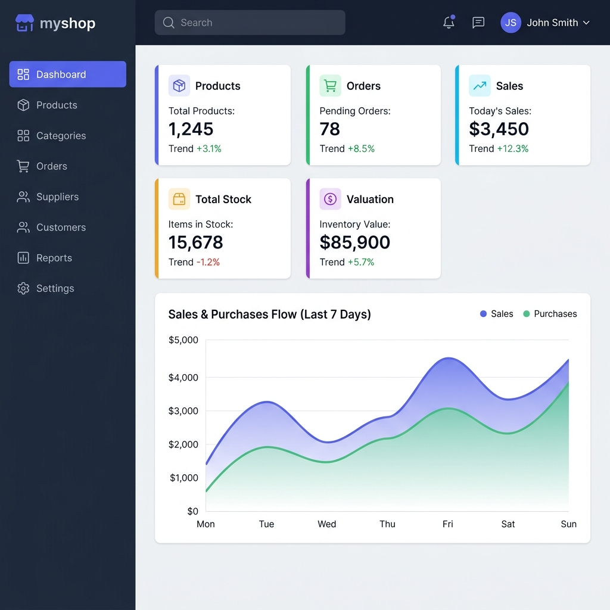

# myshop — Inventory & POS System

A full-featured point-of-sale and inventory management system built with PHP and MySQL. Designed for small-to-medium retail businesses that need a fast, reliable way to handle daily sales, track stock, manage customers and suppliers, and generate invoices — all from a single dashboard.



---

## Why This Project?

Most small shops either rely on pen-and-paper or overpay for bloated SaaS tools. **myshop** fills that gap: it's lightweight, runs on any XAMPP/LAMP stack, and covers the essentials without the complexity. No frameworks, no build tools — just clean PHP that works out of the box.

---

## What It Does

**POS Terminal** — A real-time point-of-sale interface. Click products to add them to cart, switch between sale and purchase modes, assign customers or suppliers to each transaction, and confirm with a single click. Stock updates instantly.

**Dashboard** — At a glance: total products, orders, revenue, stock levels, and inventory valuation. A 7-day sales/purchases chart and category distribution doughnut give you the full picture. Low-stock alerts tell you exactly what needs restocking.

**Order History & Invoices** — Every transaction is logged with full details. View any order, see the line items, and download a professional PDF invoice. Filter by sales or purchases, export to CSV for accounting.

**Products & Categories** — Full CRUD for your catalog. Upload product images, set prices, track stock levels, and define low-stock alert thresholds. Organize everything into categories.

**Customers & Suppliers** — Maintain a contact database for both sides of your business. Link customers to sales and suppliers to purchases for complete traceability.

**Stock Ledger** — A chronological record of every stock movement — sales, purchases, and manual adjustments. Know exactly where every unit went.

**Staff & Settings** — Role-based access (admin vs. cashier). Admins manage staff accounts, update profiles, and change passwords. Cashiers can only operate the POS and view history.

---

## Tech Stack

| Layer | Technology |
|-------|-----------|
| Backend | PHP 8+ (native, no framework) |
| Database | MySQL / MariaDB |
| Frontend | Bootstrap 5, Chart.js, SweetAlert2 |
| Fonts | Google Fonts (Outfit, Inter) |
| Icons | Font Awesome 6 Free |
| PDF Export | html2pdf.js |
| Server | Apache (XAMPP / LAMP) |

---

## Getting Started

```bash
# 1. Clone the repo
git clone https://github.com/mohammad-emad-dev/myshop-PHP-System.git

# 2. Move to your web server directory
cp -r myshop-PHP-System /path/to/htdocs/myshop

# 3. Import the database
mysql -u root -p < database/schema.sql

# 4. Open in browser
http://localhost/myshop/public/login.php
```

**Default admin login:**
- Username: `admin`
- Password: `admin123`

> The system auto-creates the database and tables on first run if they don't exist. Just make sure MySQL is running.

---

## Project Structure

```
myshop/
├── config/          # Database connection & auto-migration
├── database/        # SQL schema with seed data
├── includes/
│   ├── functions.php    # All business logic (CRUD, auth, helpers)
│   └── layouts/         # Shared UI components (header, sidebar, navbar, footer)
├── public/
│   ├── assets/
│   │   ├── css/style.css   # Complete design system
│   │   └── js/script.js
│   ├── index.php           # Dashboard
│   ├── orders.php          # POS terminal
│   ├── order_history.php   # Transaction history + invoices
│   ├── products.php        # Product management
│   ├── categories.php      # Category management
│   ├── customers.php       # Customer management
│   ├── suppliers.php       # Supplier management
│   ├── stock_movements.php # Stock ledger
│   └── settings.php        # Profile & staff management
└── uploads/          # Product images
```

---

## Security

- **CSRF protection** on every form and destructive action
- **Bcrypt password hashing** with `PASSWORD_BCRYPT`
- **Prepared statements** everywhere — no raw SQL concatenation
- **Session regeneration** on login to prevent fixation attacks
- **Input sanitization** on all user-submitted data
- **Role-based access control** — admin-only pages are enforced server-side

---

## License

MIT — use it however you want.

---

## Contact

Built by **Mohammad Emad**

[](https://www.linkedin.com/in/%E2%80%AAmohammad-emad%E2%80%AC%E2%80%8F-61532b160)