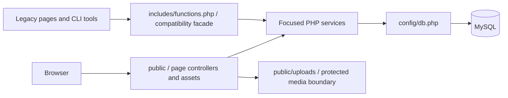
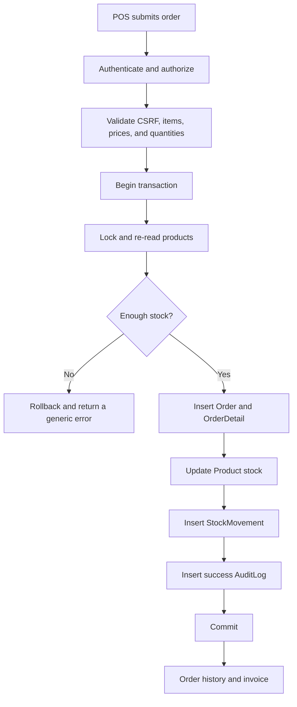
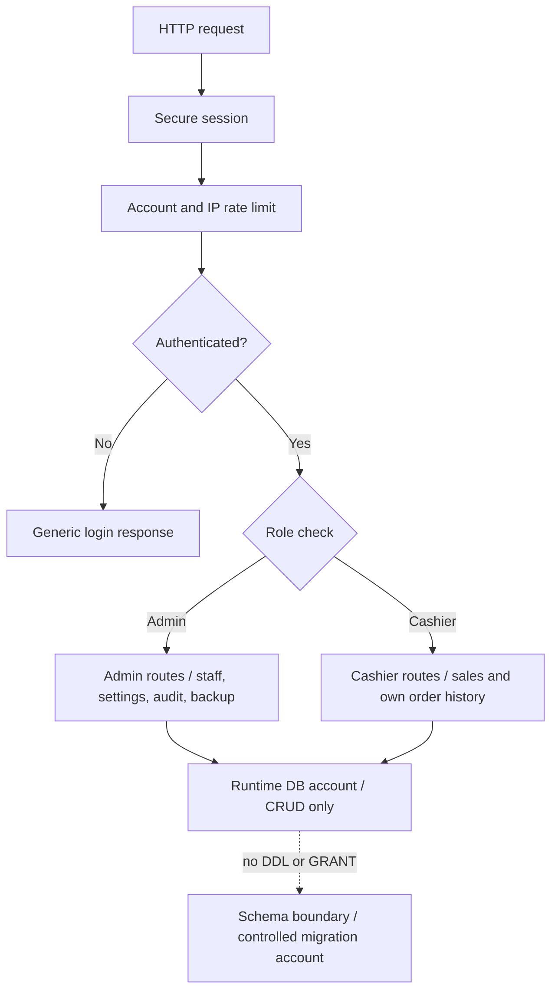

# MyShop architecture diagrams

These diagrams describe the current localhost-first architecture. They show ownership and trust boundaries rather than every individual function.

## 1. Request and service ownership

HTTP concerns stay at the public boundary. Business rules live in focused services. The compatibility facade is an adapter for existing callers; focused services do not depend on it.

## 2. Transactional order and stock lifecycle

The server recalculates the order from current database state. A failed validation or write rolls the transaction back, so an order cannot leave stock and history out of sync.

## 3. Authentication, authorization, and data boundaries

Authentication and authorization are separate decisions. The application account can read and change business rows, but it cannot change the schema or grant privileges.

The database, upload, and local environment boundaries are intentionally local. Docker host ports bind to 127.0.0.1 by default, and .env is never committed.
